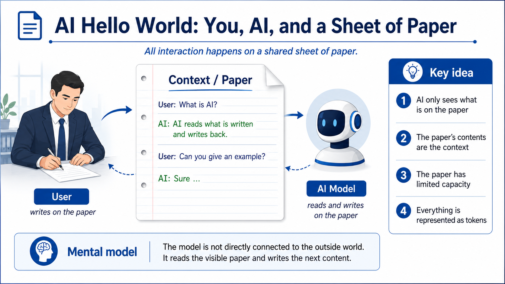
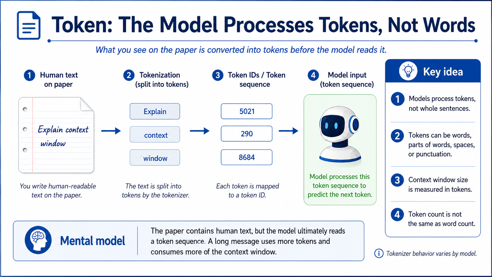
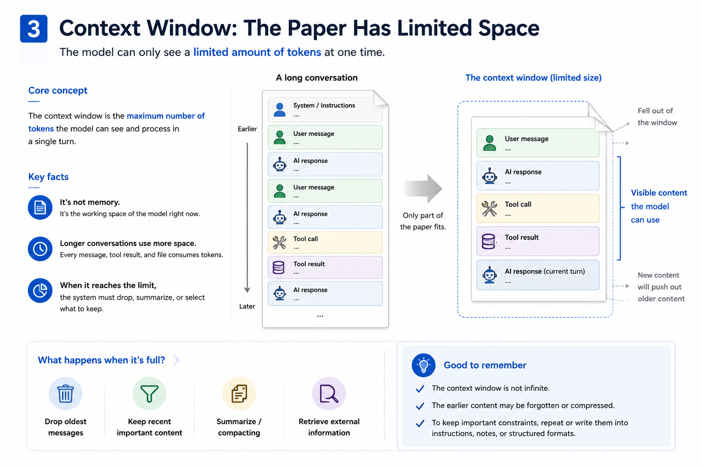

# Lesson 1 Assets

Lesson 1: **AI Fundamentals: Model, Token, Context, and Tools**

这些图片服务于课程第一部分，用来解释 Paper Model 中的基础概念。

## Visual Index

| File | Course Section | Purpose |
|---|---|---|
| `assets/01-ai-paper-interaction.png` | 1.2 AI Hello World | 解释用户、纸面上下文与 AI 模型之间的基本互动 |
| `assets/02-tokenization.png` | 1.3 Token | 解释模型处理 token，而不是直接处理完整自然语言句子 |
| `assets/03-system-prompt.png` | 1.5 System Prompt | 解释系统提示词像预先写在纸顶端的规则 |
| `assets/04-tool-use.png` | 1.11 Tools | 解释 AI 写工具请求，Harness 负责验证和执行 |
| `assets/05-context-window.png` | 1.7 Context Window | 解释上下文窗口是模型当前可见内容的容量限制 |

## Images

### 1.2 AI Hello World

### 1.3 Token

### 1.5 System Prompt

### 1.11 Tool Use

### 1.7 Context Window

