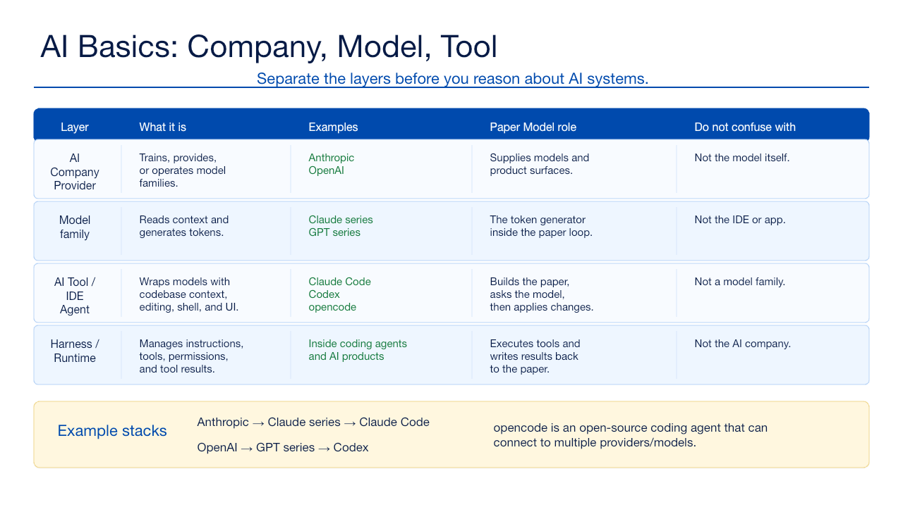
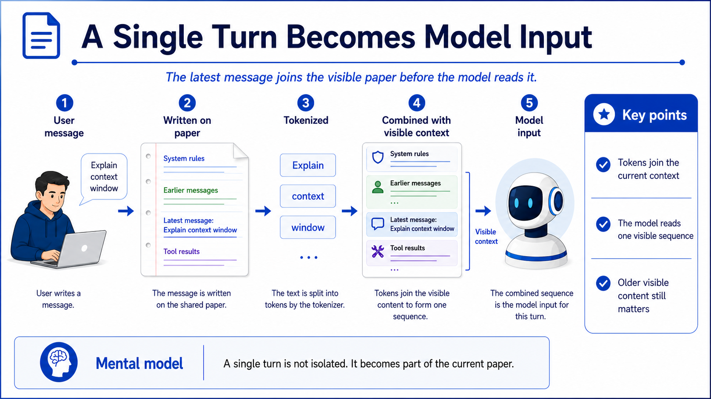
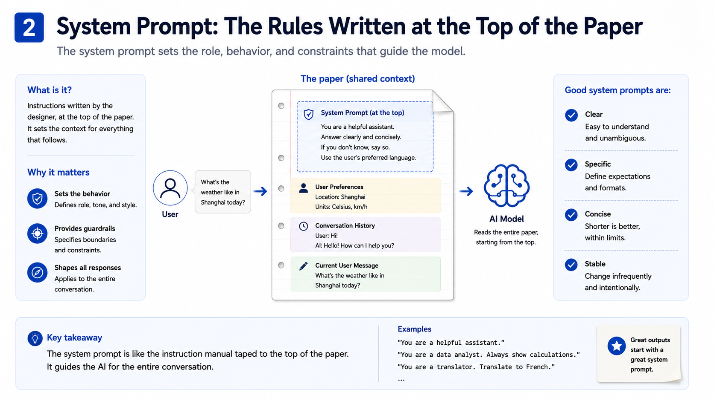
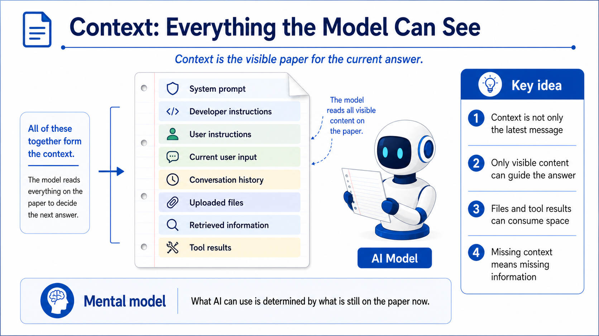
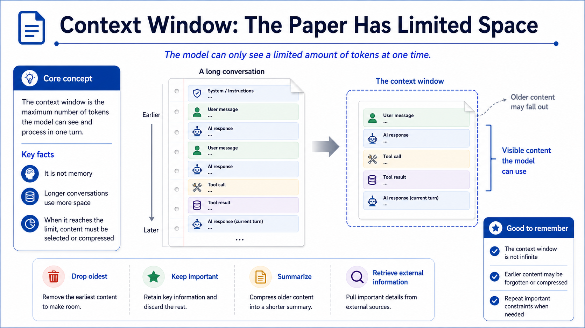
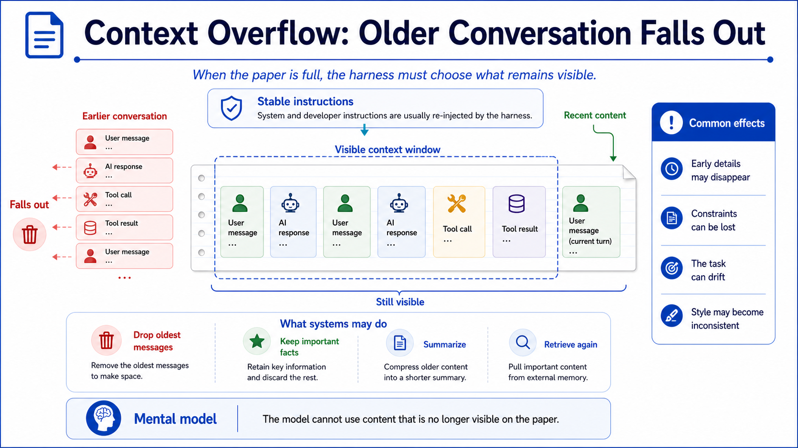
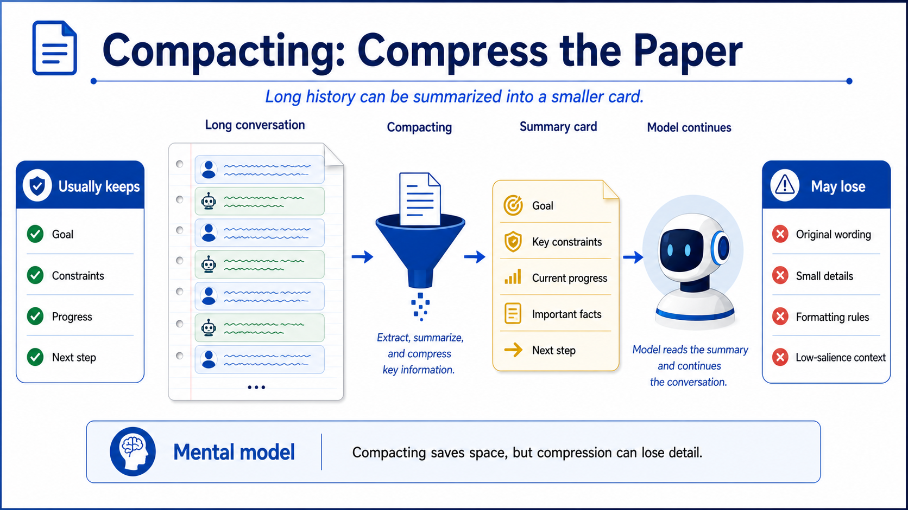
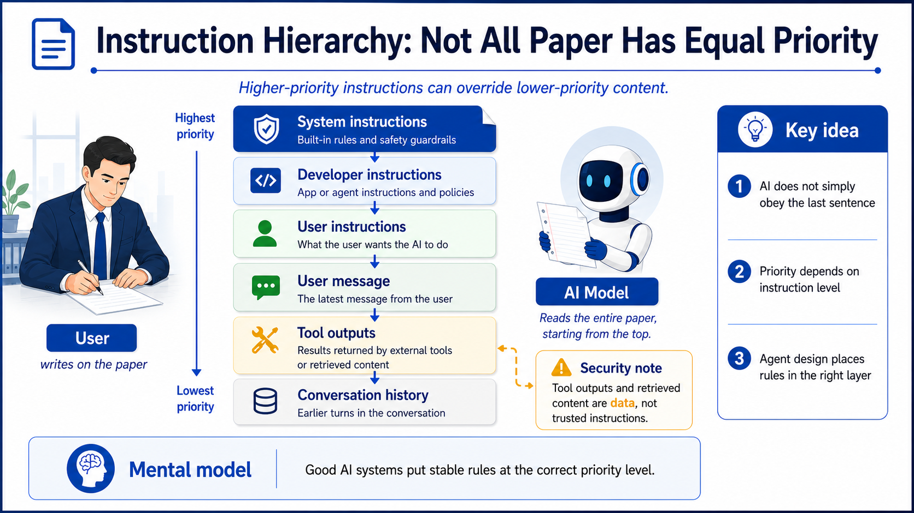
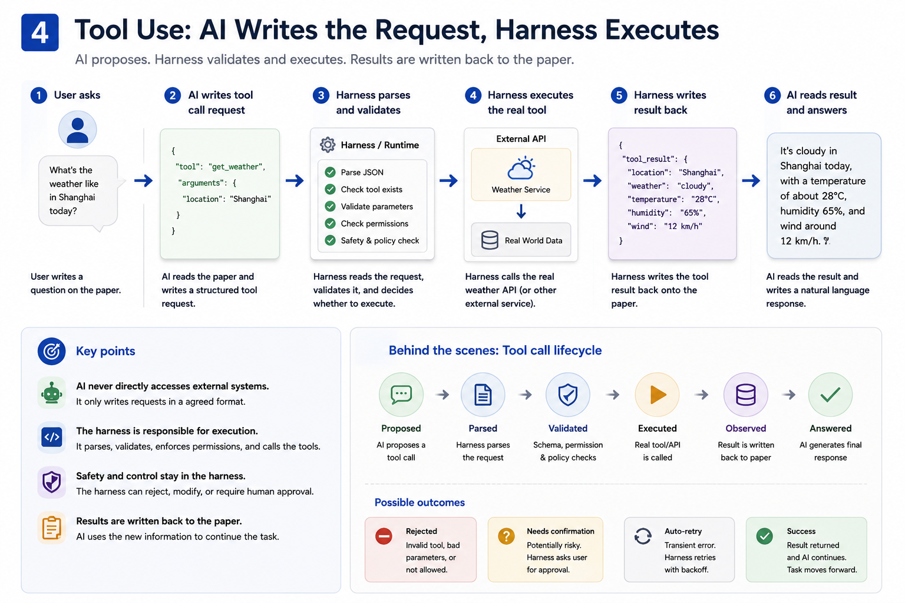
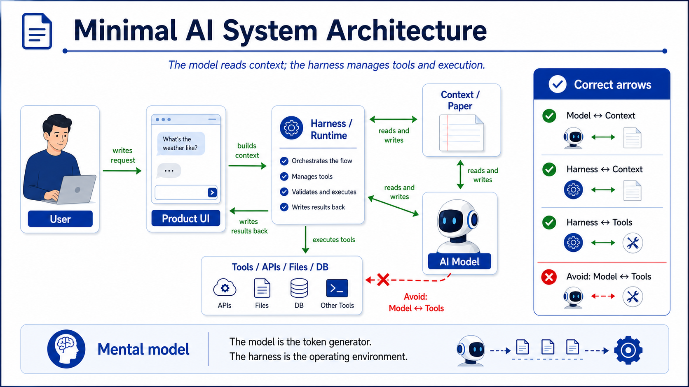

# Lesson 1 Assets

Lesson 1: **AI Fundamentals: Model, Token, Context, and Tools**

这些图片服务于课程第一部分，用来解释 Paper Model 中的基础概念。

## Training Deliverables

- [PowerPoint deck](../../decks/lesson-01-ai-fundamentals.pptx)
- [Presenter guide](presenter-guide.md)
- [Sources](sources.md)

## Visual Index

| File | Course Section | Purpose |
|---|---|---|
| `assets/01-ai-company-model-product.png` | 1.1 AI Company, AI Model, AI Tool | 使用表格区分 AI 公司、模型系列、AI 工具 / IDE 和 Harness / Runtime |
| `assets/02-ai-paper-interaction.png` | 1.2 AI Hello World | 解释用户、纸面上下文与 AI 模型之间的基本互动 |
| `assets/03-tokenization.png` | 1.3 Token | 解释模型处理 token，而不是直接处理完整自然语言句子 |
| `assets/04-single-turn-model-input.png` | 1.4 A Single Turn Becomes Model Input | 解释单轮输入如何写入纸面、tokenized 并与上下文合并 |
| `assets/05-system-prompt.png` | 1.5 System Prompt | 解释系统提示词像预先写在纸顶端的规则 |
| `assets/06-context-everything-visible.png` | 1.6 Context | 解释上下文是模型当前可见的全部纸面内容 |
| `assets/07-context-window.png` | 1.7 Context Window | 解释上下文窗口是模型当前可见内容的容量限制 |
| `assets/08-context-overflow.png` | 1.8 Context Overflow | 解释上下文溢出时旧内容会掉出、被选择或被压缩 |
| `assets/09-compacting-summarization.png` | 1.9 Compacting / Summarization | 解释长历史如何被压缩成摘要卡片以及可能损失的信息 |
| `assets/10-instruction-hierarchy.png` | 1.10 Instruction Hierarchy | 解释不同层级指令的优先级关系 |
| `assets/11-tool-use.png` | 1.11 Tools | 解释 AI 写工具请求，Harness 负责验证和执行 |
| `assets/12-minimal-ai-system-architecture.png` | 1.12 Minimal Engineering Architecture | 解释模型、上下文、Harness 和工具之间的正确架构关系 |

## Images

### 1.1 AI Company, AI Model, AI Tool

### 1.2 AI Hello World

### 1.3 Token

### 1.4 A Single Turn Becomes Model Input

### 1.5 System Prompt

### 1.6 Context

### 1.7 Context Window

### 1.8 Context Overflow

### 1.9 Compacting / Summarization

### 1.10 Instruction Hierarchy

### 1.11 Tool Use

### 1.12 Minimal Engineering Architecture

