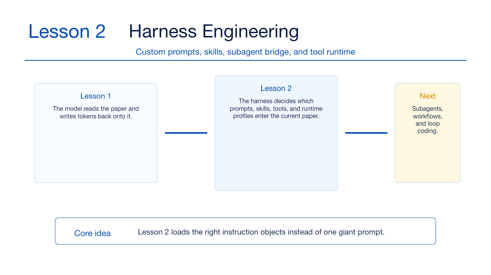
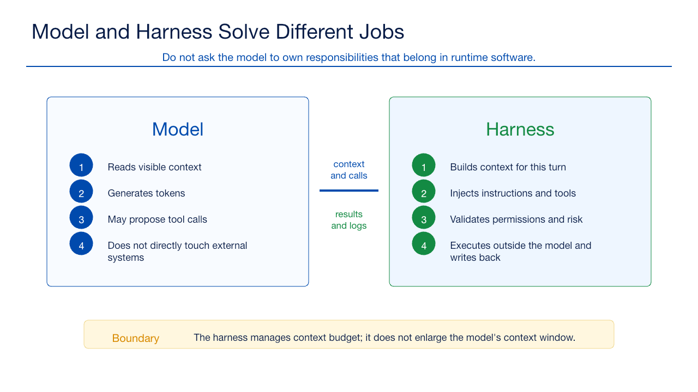
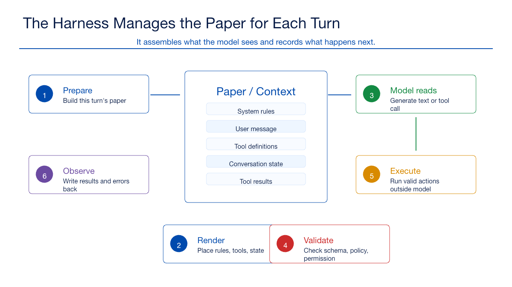
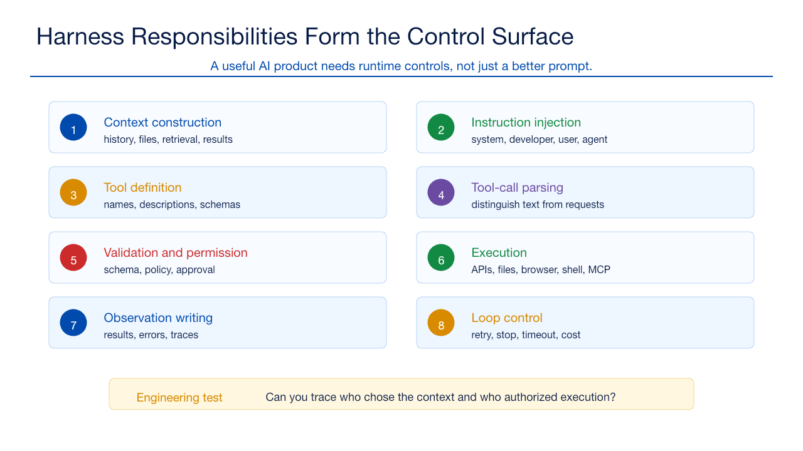
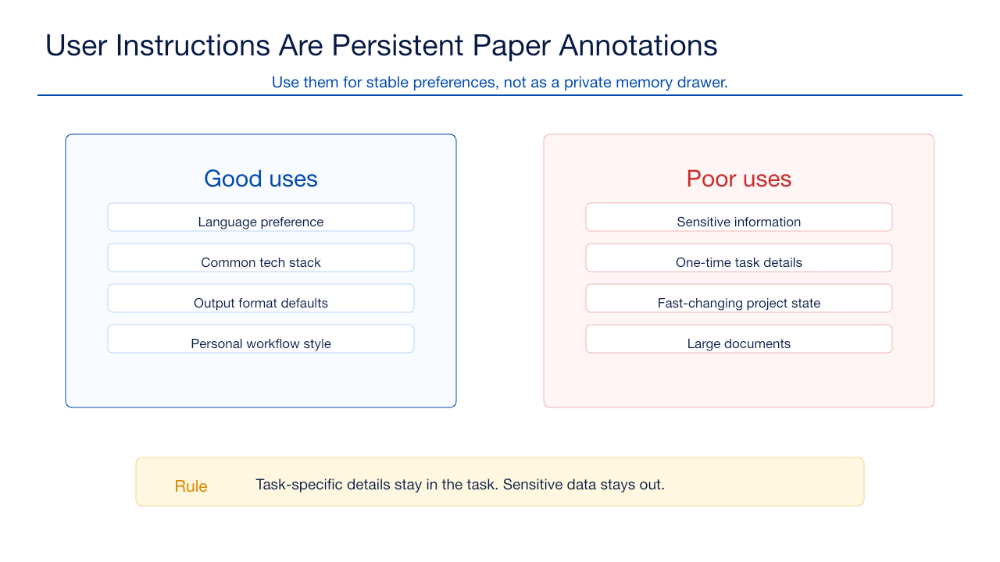
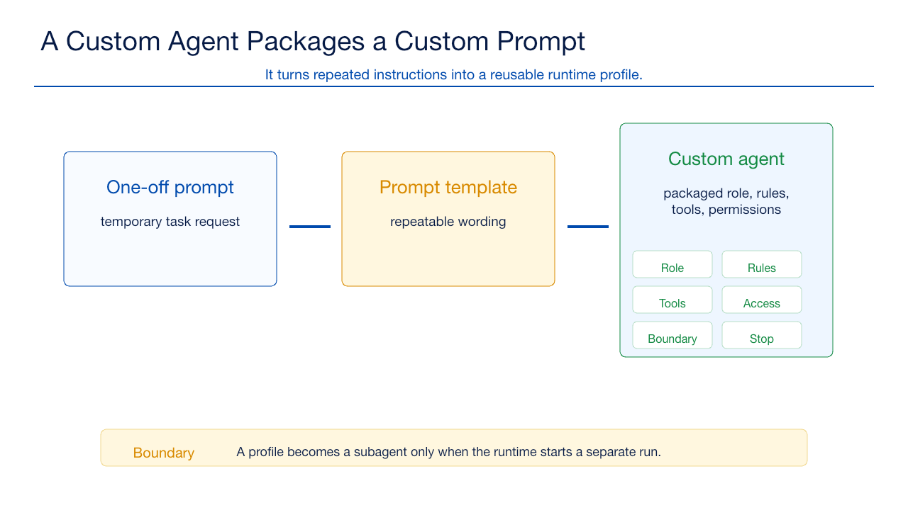
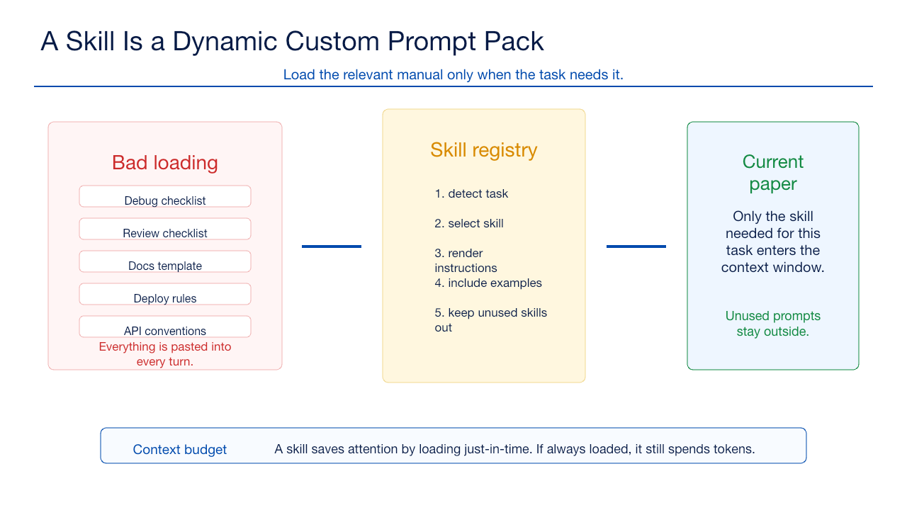
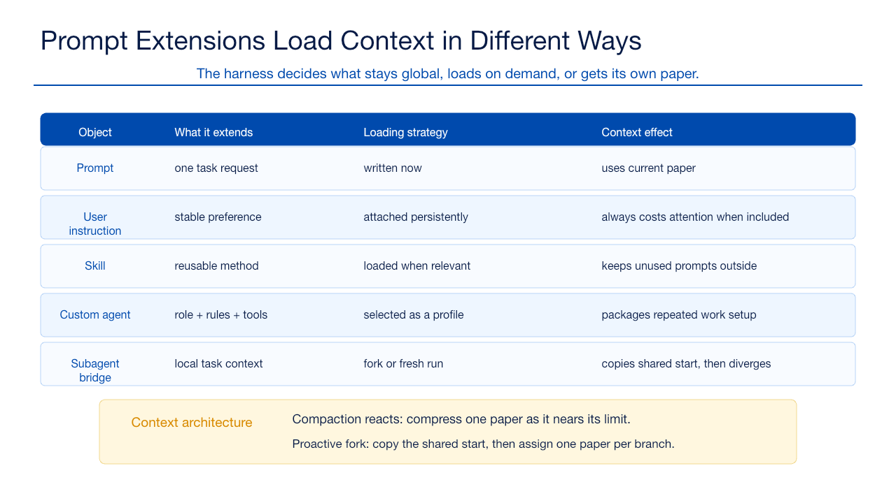
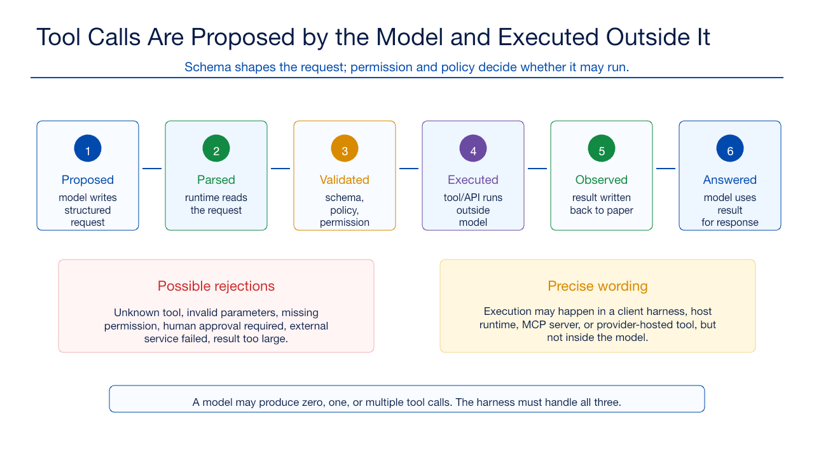
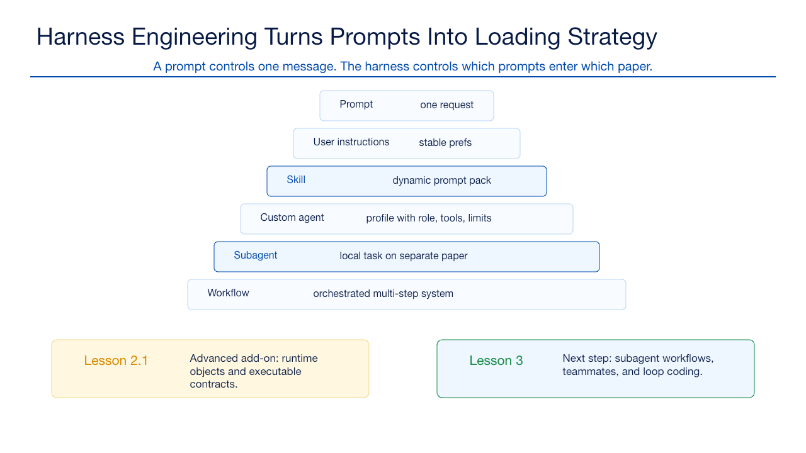

# Lesson 2 Assets

Lesson 2: **Harness Engineering: Instructions, Agents, Skills, and Tool Runtime**

这些图片服务于课程第二部分，用来解释 Harness / Runtime 如何把一个模型变成可用、可控、可审计的 AI 系统。

## Training Deliverables

- [PowerPoint deck](../../decks/lesson-02-harness-engineering.pptx)
- [Presenter guide](presenter-guide.md)
- [Sources](sources.md)

## Visual Index

| File | Course Section | Purpose |
|---|---|---|
| `assets/slide-01.png` | 2.1 Why Harness Is Needed | 从 Lesson 1 的模型视角过渡到 Lesson 2 的运行时视角 |
| `assets/slide-02.png` | 2.1 Model vs Harness | 区分模型的 token generation 和 Harness 的运行时管理责任 |
| `assets/slide-03.png` | 2.2 Harness as Paper Manager | 解释 Harness 如何准备纸面、读取模型输出、执行工具并回写结果 |
| `assets/slide-04.png` | 2.3 Core Responsibilities of Harness | 总览 Harness 的八项核心责任 |
| `assets/slide-05.png` | 2.4 User Instructions | 解释用户指令适合稳定偏好，不适合敏感或临时状态 |
| `assets/slide-06.png` | 2.5 Custom Agent | 解释 Custom Agent 是 packaged custom prompt 加 runtime profile |
| `assets/slide-07.png` | 2.6 Skills | 解释 Skill 是按需动态加载的 custom prompt / manual |
| `assets/slide-08.png` | 2.7 Prompt Extensions and Runtime Boundaries | 对比 prompt、user instruction、skill、custom agent 和 subagent bridge |
| `assets/slide-09.png` | 2.8 Tool Call Lifecycle | 解释模型提出工具请求，模型外运行时执行并回写结果 |
| `assets/slide-10.png` | 2.9-2.10 Harness Engineering in Practice | 收束到从 Prompt Engineering 到 Harness Engineering |

## Images

### 2.1 Why Harness Is Needed

### 2.1 Model vs Harness

### 2.2 Harness as Paper Manager

### 2.3 Core Responsibilities of Harness

### 2.4 User Instructions

### 2.5 Custom Agent

### 2.6 Skills

### 2.7 Prompt Extensions and Runtime Boundaries

### 2.8 Tool Call Lifecycle

### 2.9-2.10 Harness Engineering in Practice

