# Lesson 3 Assets

Lesson 3: **Systematic Subagent Orchestration**

这些图片服务于课程第三部分，用来解释复杂 AI 任务如何系统化调用 subagents，并把“谁持有计划”作为三种模式的核心差异：主 AI 临时组织团队、主 AI 调用预先写好的 custom agent files、以及由 workflow script 编排 subagents。

## Training Deliverables

- [PowerPoint deck](../../decks/lesson-03-agentic-workflows.pptx)
- [Presenter guide](presenter-guide.md)
- [Sources](sources.md)

## Visual Index

| File | Course Section | Purpose |
|---|---|---|
| `assets/slide-01.png` | 3.1 Overview | 引出系统化调用 subagents 的三种方式 |
| `assets/slide-02.png` | 3.1 Why Orchestration | 说明复杂任务会造成 context noise、compaction 风险和 merge confusion |
| `assets/slide-03.png` | 3.2 Way 1 | 解释让 AI 临时组织 subagent team 的通用模式 |
| `assets/slide-04.png` | 3.2 Ad Hoc Team Gates | 说明临时团队需要 brief、evidence、return format 和 merge gate |
| `assets/slide-05.png` | 3.3 Way 2 | 解释主 AI 调用预先编写的 custom agent files |
| `assets/slide-06.png` | 3.3 Teammate-Style Collaboration | 说明部分 harness 支持 subagents/teammates 之间的 bounded communication |
| `assets/slide-07.png` | 3.4 Way 3 | 解释 workflow script 持有计划并用 JavaScript 编排 agents |
| `assets/slide-08.png` | 3.4 Workflow Gates | 区分 schema format gate 与 verifier truth gate |
| `assets/slide-09.png` | 3.5 Compaction Strategy | 对比 reactive compaction 与 proactive subagent split |
| `assets/slide-10.png` | 3.6 Goodhart's Law | 用 intent -> proxy target -> result 说明代理指标反噬 |
| `assets/slide-11.png` | 3.6 Workflow Quality Control | 说明 workflow 如何缓解 custom agent files 的 Goodhart side effect |

## Images

### 3.1 Overview

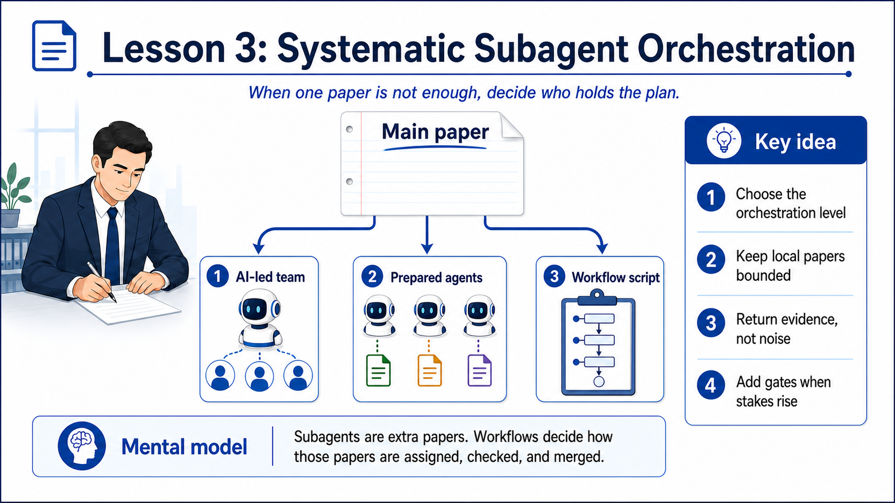

### 3.1 Why Orchestration

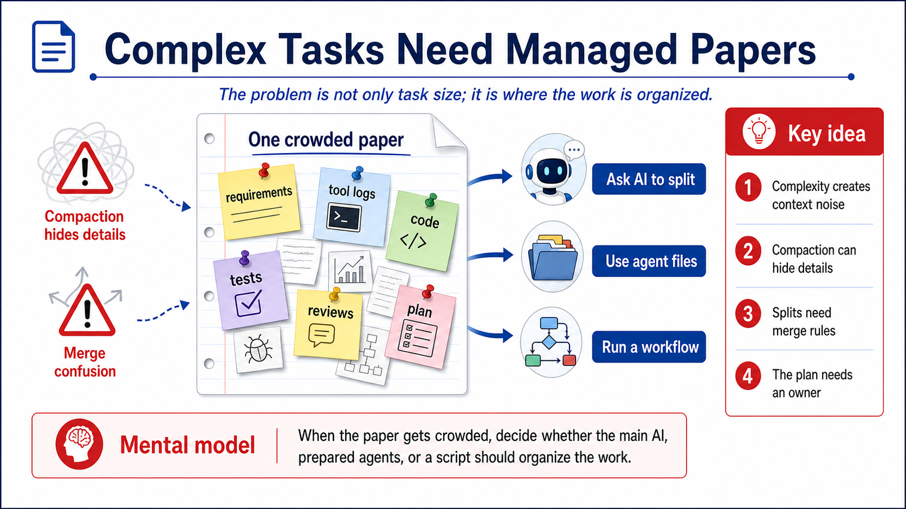

### 3.2 Way 1

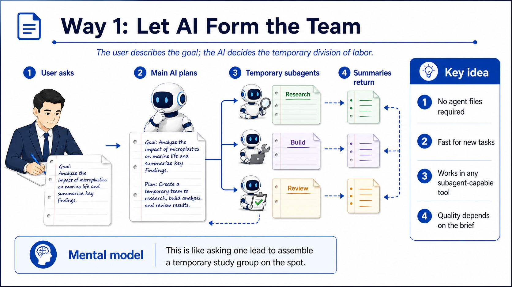

### 3.2 Ad Hoc Team Gates

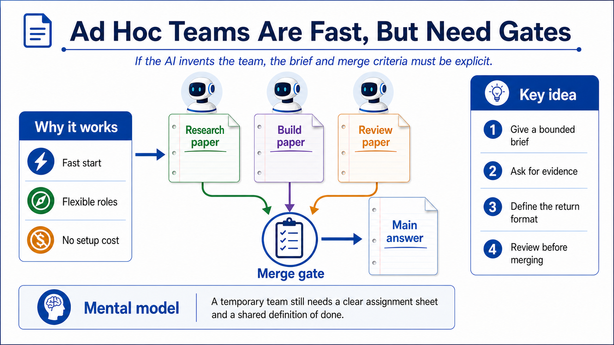

### 3.3 Way 2

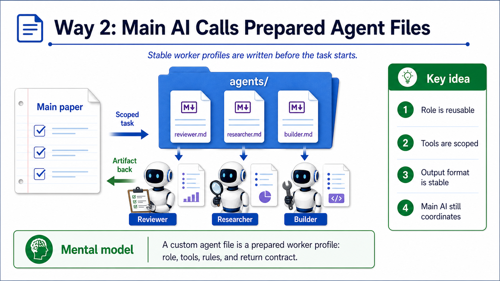

### 3.3 Teammate-Style Collaboration

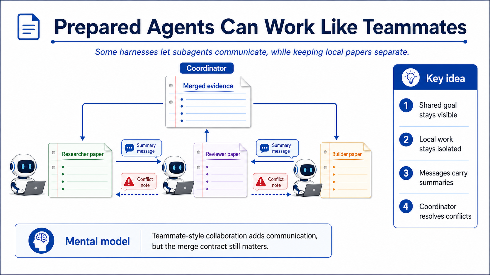

### 3.4 Way 3

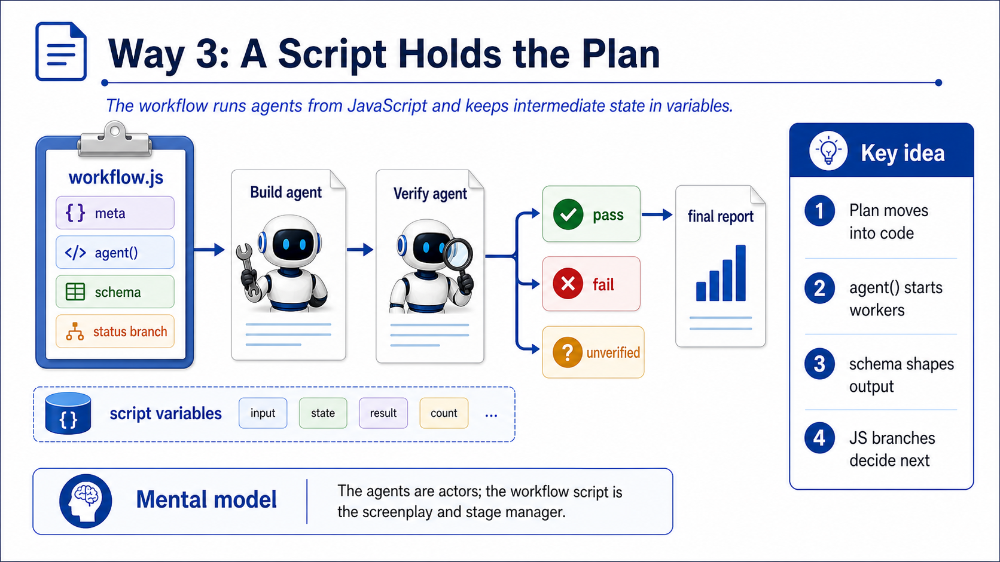

### 3.4 Workflow Gates

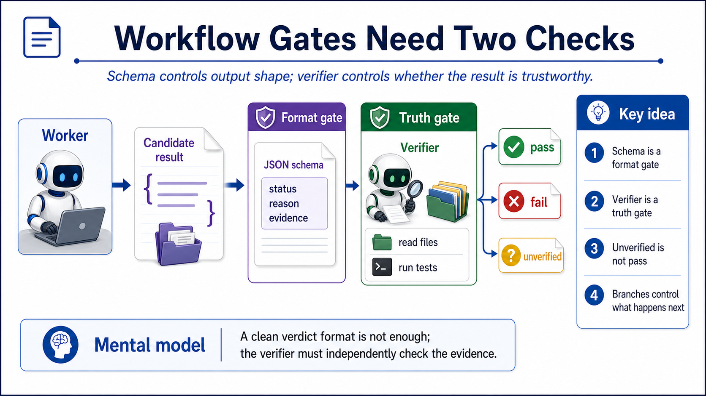

### 3.5 Compaction Strategy

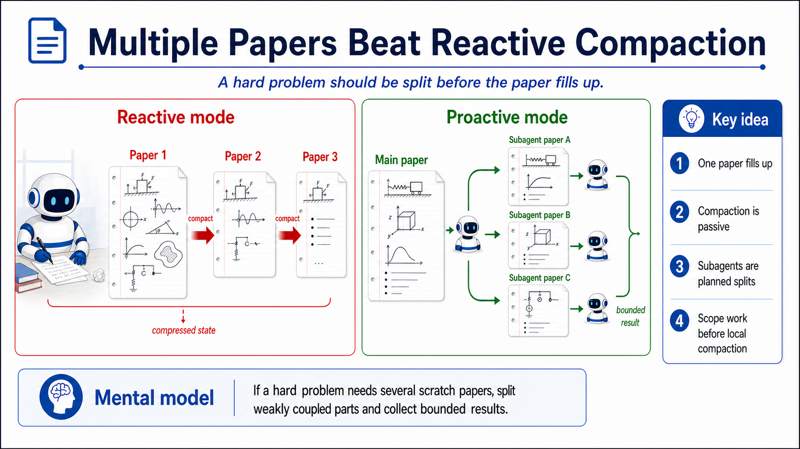

### 3.6 Goodhart's Law

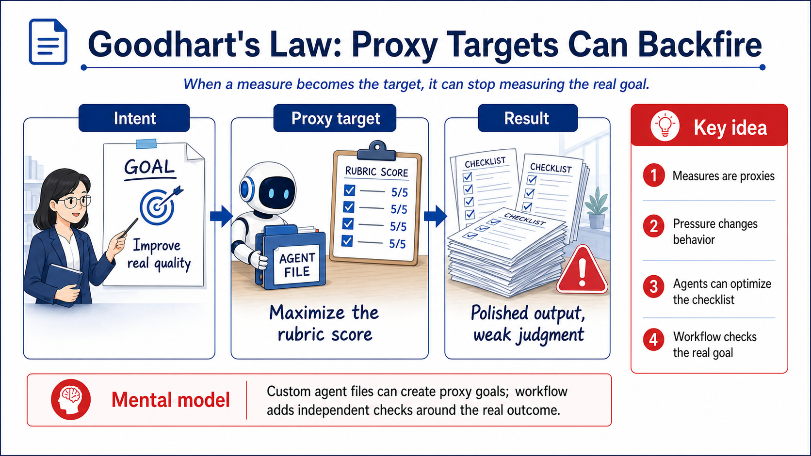

### 3.6 Workflow Quality Control

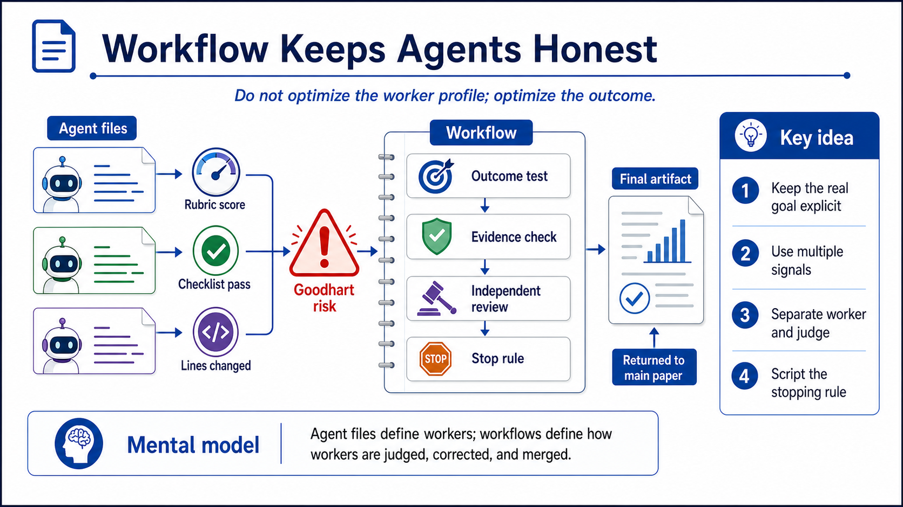
